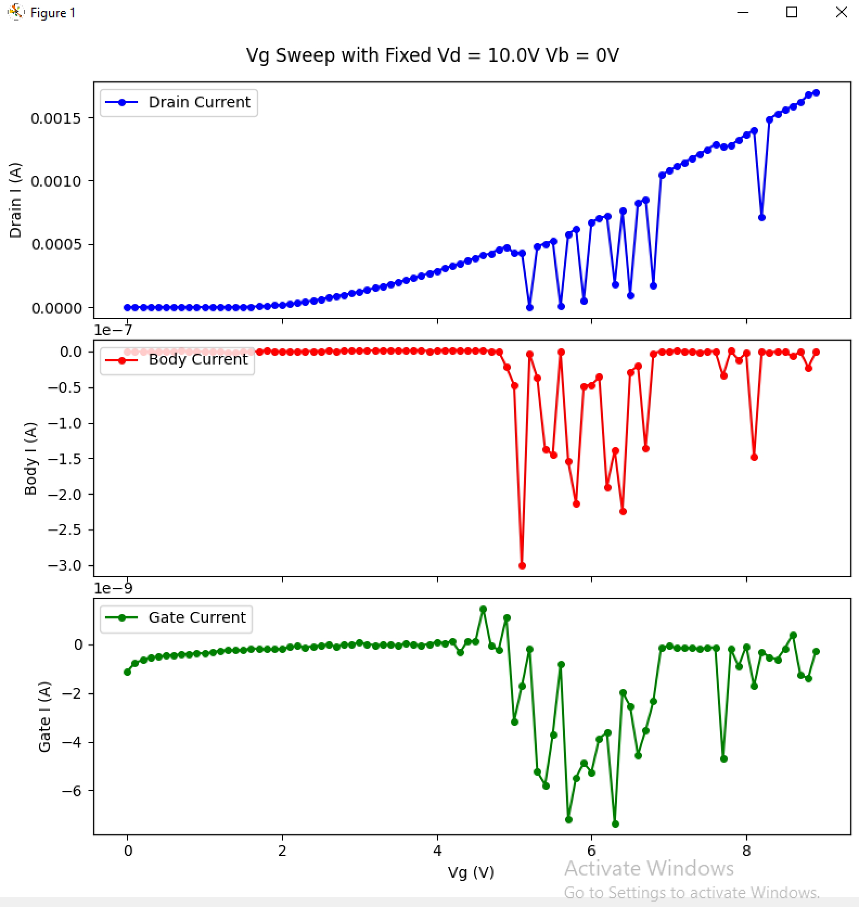
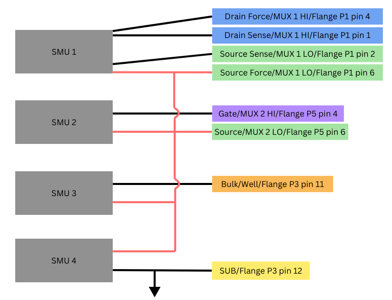

# PyVISA Instrument Control

A Python library for controlling multiple SMUs, DAQs, and Power Supplies simultaneously, designed for the testing hardware configuration at Fermilab.

## Table of Contents

1. [Overview](#overview)  
2. [Installation](#installation)  
   - [Python and Required Packages](#python-and-required-packages)  
   - [NI-VISA and GPIB Driver Setup](#ni-visa-and-gpib-driver-setup)  
   - [Mac Users](#mac-users)  
   - [Verifying Connections in NI MAX](#verifying-connections-in-ni-max)  
3. [Features](#features)  
4. [Repository Structure](#repository-structure)  
5. [Instrument Setup Notes](#instrument-setup-notes)
6. [Script Setup Notes](#script-setup-notes)
7. [Test Scripts](#test-scripts)  
8. [Two-wire vs 4-wire Measurements](#two-vs-four)

---

## 1. Overview

**PyVISA Instrument Control** provides a way to manage and automate measurements with various Keithley SMUs, DAQs, and Power Supplies. It enables measuring of transistor characteristics by loading predefined bias and multiplexer channel instructions.

---

## 2. Installation

### Python and Required Packages

1. Install [Python](https://www.python.org/downloads/) (3.x).  
2. Install the required Python libraries:
   ```bash
   pip install matplotlib pyvisa
   ```
3. Clone or download this repository.

### NI-VISA and GPIB Driver Setup

This library communicates with instruments via [NI-VISA](https://www.ni.com/en/support/downloads/drivers/download.ni-visa.html#487529). For GPIB instruments, you will also need the [NI-488.2 driver](https://www.ni.com/en/support/downloads/drivers/download.ni-488-2.html#544048).

1. **Download and install NI-VISA**  
2. **Download and install NI-488.2 driver (for GPIB devices)**

### Mac Users

NI-VISA driver support on macOS can be limited or tricky. If you encounter issues, a reliable workaround is to use a Windows virtual machine:

1. Install [VirtualBox](https://www.virtualbox.org/) (or any virtualization software).  
2. Create a Windows VM. You will need a 64 bit iso, you can get [Windows 10 64 bit iso here](https://www.microsoft.com/en-us/software-download/windows10ISO)
3. Within the VM, install:
   - Python and PyVISA  
   - NI-VISA and NI-488.2  
   - Your favorite Python IDE (e.g., [PyCharm Community Edition](https://www.jetbrains.com/pycharm/download/))  
   - Git (optional, from [Git for Windows](https://git-scm.com/downloads/win) or use the built-in options)  
4. **USB Device Passthrough**: In the VM’s "Devices" → "USB" menu, pass your instruments (Keithleys, etc.) into the VM.  
5. Check that NI MAX can see your GPIB/USB instruments within the VM.  

### Verifying Connections in NI MAX

After installing NI-VISA/NI-488.2 and connecting instruments, open **NI MAX**:

1. In the left panel, find your GPIB interface under "Devices and Interfaces."  
2. Right-click and select **Scan for Instruments**.  
3. Your Keithley (or other) instrument should appear. Click on it, then select **Open VISA Test Panel**.  
4. Go to the **Input/Output** tab and press the **Query** button to verify communication. If it returns without error, you’re ready to use PyVISA in Python.  

> **Note**: Ensure your Keithley instrument is configured to the correct communication mode (GPIB, RS232, USB, etc.) via its front panel/menu.

---

## 3. Features

- **Spreadsheet-Driven Instructions**: Loads voltage/current bias instructions for different transistor flavors (HV, MV, LV).  
- **MUX Control**: Manages MUX channel switching to target specific transistor terminals.  
- **Multiple Instruments**: Coordinates simultaneous control over SMUs, Temperature Monitors, and DAQs.  
- **Live Plotting**: Provides real-time plots of measured data.  
- **Flexible communication protocol**: Enables use of instruments that use both SCPI and older proprietary ASCII-based commands, like HP
BASIC 4.0 IEEE-488 Statements.
- **Cool Down Measurements**: Enables data taking for a given set of transistors during cool down.
- **Safe Instrument Deactivation**: Allows for turning off of instruments safely to avoid voltage spikes.

---

## 4. Repository Structure

1. **`01_save_mux_bias_instructions.py`**  
   - Preprocesses MUX/Bias instructions from an Excel file.  
   - Outputs JSON files used in subsequent measurement scripts.
2. **`02_take_measurements.py`**  
   - Main script for taking device measurements.  
   - Loads the JSON bias instructions (HV, MV, LV; PFET or NFET).  
   - Provides a live plot of collected data including voltages, currents, and temperatures.
   - Saves output data in the `Data/` folder.
3. **`03_safely_turn_off_instrum_outputs.py`**
   - If you don't fully allow the main measuring script to complete, and need to run off the instrument outputs, run this script.
4. **`04_plot_results.py`**  
   - Plots the measurement data generated by `02_take_measurements.py`.  
5. **`05_...py` / `06_...py`**  
   - Additional plotting scripts for correlations and other analyses.  
6. **`test_*.py` Scripts**  
   - Individual scripts to test specific functionality (e.g., reading current, voltage, IV curves, MUX switching).

**Recommended workflow**:  
1. Run `01_save_mux_bias_instructions.py` to create the JSON instruction files.
2. Run `02_take_measurements.py` to execute actual measurements at Room Temp and desired cryo temps.
3. Run `03_plot_results.py` (and `04_...py` / `05_...py` if needed) to visualize the data.

---

## 5. Instrument Setup Notes

- **Keithley 2400/2410/237/6430**:  
  - Ensure the instrument is in **GPIB mode** (front-panel menu: "Menu" → "Communication" → "GPIB").  
- **DAQ 6510**:  
  - Press the **TERMINALS** button and select **Rear** to use the rear terminals (if that’s where your connections are).
- **Lakeshore Temperature Controller 335**:
  - Press the Local/Remote key to put it in remote mode
- **Other**: 
  - Make sure that any power cables (like a laptop charger) are routed far away from the setup. They otherwise introduce spikes like this:

    
  - Double check the SMUs are set up properly, according to this diagram where Sub is always tied to ground and source is referenced to Sub:

    
 
---

## 6. Script Setup Notes

- **Instruction Sheets**:  
  - Set the biases that you want in the test_biases.xlsx sheet. This has already been done for all three flavors in, so no need to change it unless plans change
  - Set up the mux channels in 'muxChannelInstructions_4wire_drain.xlsx' in the same format as what is there now. This will need to be adjusted for each bonding scheme (test 7/8/9..etc)
- **01_cool_down_data_taking.py**:  
  - Specify the two transistors to repeatedly measure during cool down. For robust modelling, you should choose a long gate length/width nfet and pfet
- **02_take_measurements.py**:  
  - Variables to set are all under the line: 
  ```python
  ############## User/Experimenter Settings ##############
  ```
  - Look at the room temperature PDK documentation for each transistor flavor, and get a feeling for what current range to expect. Then set the correct range for the drain current SMU (variable 'drain_curr_range'). The other SMU ranges can probably stay fixed, and are currently configured for maximum sensitivity to low currents (through the gate/body)
  - Set settle_delay depending on measurement results and preferences... if you are seeing spikes in the IV curve that dont look like real physics, it may be that you want to increase delay time between setting voltage and measuring current, to make sure the spikes are real physics. The tradeoff is that higher settle_delay increases measuring time
  - Check the rest of the settings. You probably want live_plot to stay true for monitoring. Current compliance at 100mA makes sense for these devices.

---

## 7. Test Scripts

These `test_0XX_*.py` scripts help you verify your setup and learn how the code operates. They’re useful for debugging or quick demos:

- **`test_001_read_i_continuously.py`**  
  Continuously reads current from a single SMU and shows a real-time plot.  
- **`test_002_read_v_continuously.py`**  
  Continuously reads voltage from a single SMU and shows a real-time plot.  
- **`test_003_read_v_and_i_continuously.py`**  
  Continuously reads both current and voltage from a single SMU.  
- **`test_004_get_1_iv_curve.py`**  
  Steps through a voltage sweep on one SMU and plots the resulting IV curve in real time.
- **`test_005_get_1_iv_curve_set_second_inst.py`**  
  Steps through a voltage sweep on one SMU and set voltage on a second smu
- **`test_006_02_take_measurements.py`**  
  A test version of the main measurement script (hand-set voltages) to avoid disturbing the primary production script.  

---

## 8. Two-wire vs 4-wire Measurements
**If you would like to do a two wire measurement on the drain current:** 
  - Disconnect the wires labeled 'force' to top smu and plug wires labeled 'sense' into SMU force. 
  - In the 02_... code change 'drain_instr_wire_mode' to '2' rather than '4'. 
  - Change 'mux_json_file' to "mux_instructions_by_transistor_2wire_drain.json". 
  - Make sure you ran script '00_...' first with the correct excel instruction sheet linked for your 2 wire measurement, and put the save name as 'mux_instructions_by_transistor_2wire_drain.json'.

**If you would like to do a four wire measurement on the drain current:**
  - Connect the wires labeled 'force' to top SMU Force terminals and plug wires labeled 'sense' into SMU Sense terminals. 
  - In the 02_... code change 'drain_instr_wire_mode' to '4' rather than '2'. 
  - Change 'mux_json_file' to "mux_instructions_by_transistor_4wire_drain.json". 
  - Make sure you ran script '00_...' first with the correct excel instruction sheet linked for your 4 wire measurement, and put the save name as 'mux_instructions_by_transistor_4wire_drain.json'.

---

If you encounter any issues, please contact olivias@fnal.gov
